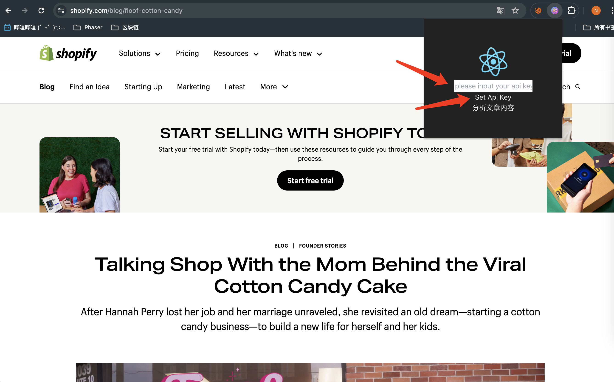
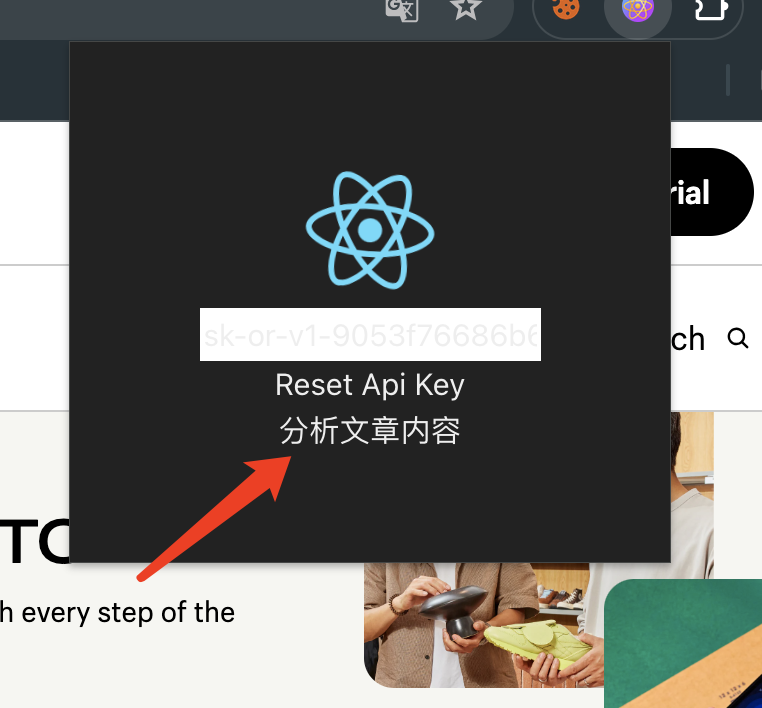
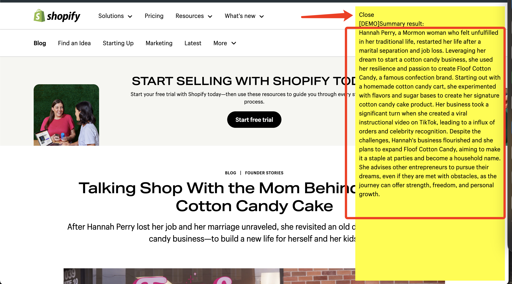

# 插件功能

分析博客内容，如：
https://www.shopify.com/blog/floof-cotton-candy

# 使用教程

1. 加载 chrome 插件
  在 chrome 浏览器的 chrome://extensions/ 页面，打开开发者模式，点击[加载已解压的扩展程序]
  选择打包文件

2. 打开 https://www.shopify.com/blog/floof-cotton-candy 页面
3. 设置 api key 
4. 点击 [分析文章内容] 
5. 查看分析结果 